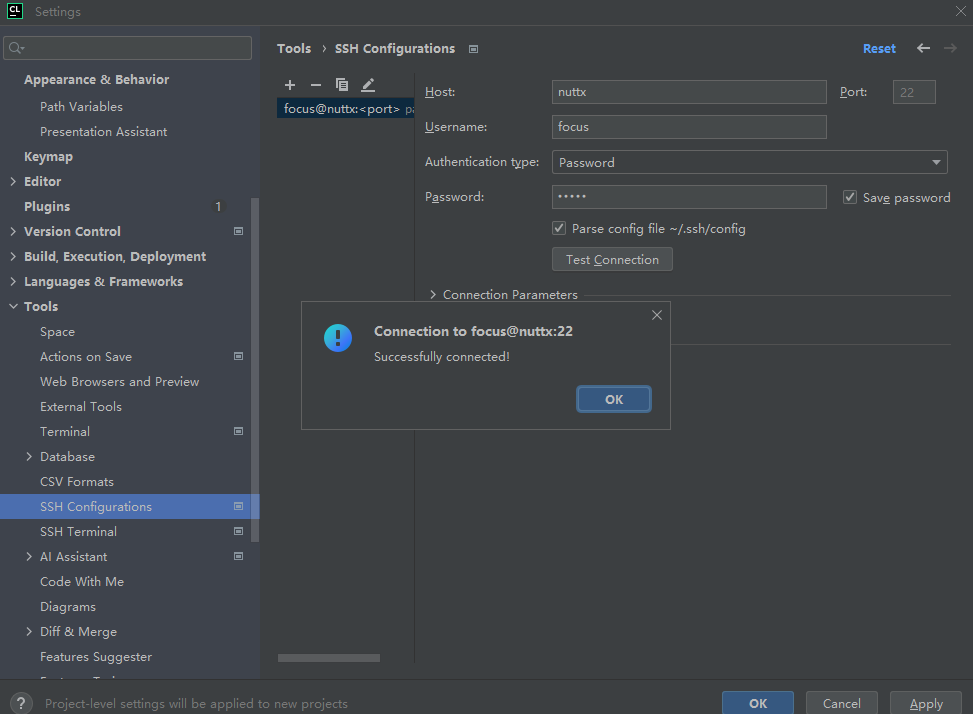
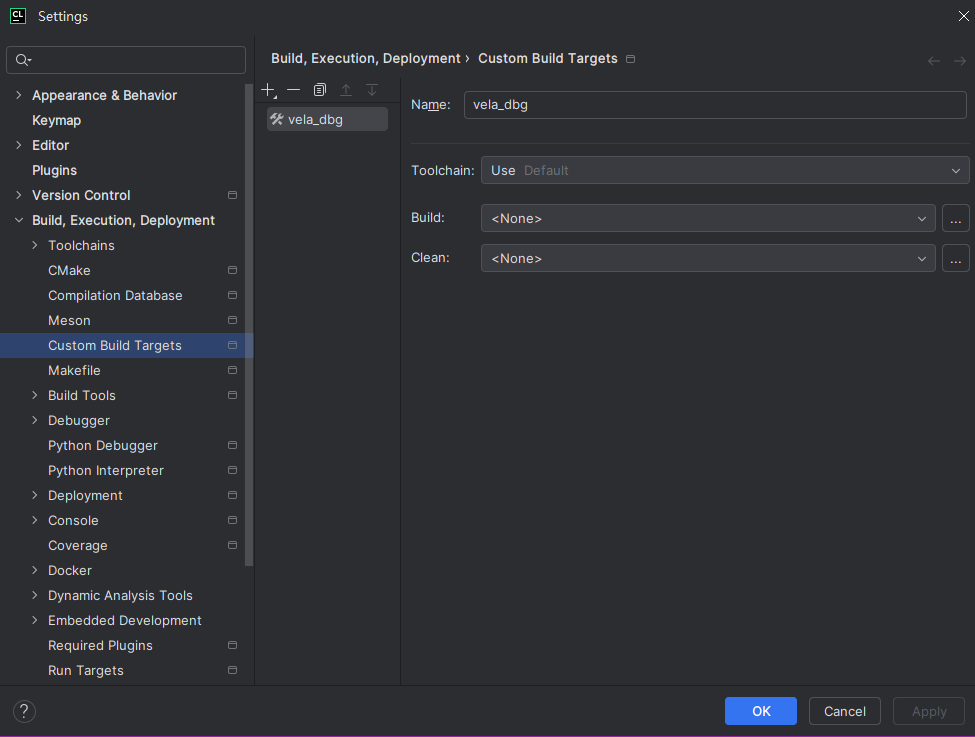

# 使用 openvela Emulator 调试

\[ [English](./Debugging_Vela_with_Vela_Emulator.md) | 简体中文 \]

## 使用 GDB Console

使用下列命令，在 Ubuntu 22.04 版本的系统上安装所需的软件包：

```bash
sudo apt update
sudo apt install gdb-multiarch
```

openvela Emulator 支持通过 GDB 远程连接工具（gdbstub）使用 GDB。可以像在真实硬件上使用 JTAG 等低级调试工具一样，调试 openvela 代码。可以停止和启动虚拟机，检查寄存器和内存等状态，并设置断点和观察点。

通过传递 `-s` 和 `-S` 选项启动 openvela Emulator 来使用 GDB。 `-s` 选项将使 openvela Emulator 在 TCP 端口 1234 上侦听来自 GDB 的传入连接，而 `-S` 将使 openvela Emulator 从 GDB 获取通知前，不会启动 guest 虚拟机。

要启用与 GDB 服务器的连接，您需要将 `-qemu -S -s` 参数传递给 `emulator.sh`。

```bash
./emulator.sh vela -qemu -S -s
```

打开新的终端，运行 `gdb-multiarch`：

```bash
gdb-multiarch nuttx/nuttx
```

```bash
GNU gdb (Ubuntu 12.1-0ubuntu1~22.04.2) 12.1
Copyright (C) 2022 Free Software Foundation, Inc.
License GPLv3+: GNU GPL version 3 or later <http://gnu.org/licenses/gpl.html>
This is free software: you are free to change and redistribute it.
There is NO WARRANTY, to the extent permitted by law.
Type "show copying" and "show warranty" for details.
This GDB was configured as "x86_64-linux-gnu".
Type "show configuration" for configuration details.
For bug reporting instructions, please see:
<https://www.gnu.org/software/gdb/bugs/>.
Find the GDB manual and other documentation resources online at:
    <http://www.gnu.org/software/gdb/documentation/>.

For help, type "help".
Type "apropos word" to search for commands related to "word"...
Reading symbols from nuttx/nuttx...
```

需要创建一个远程连接，用与主机 GDB 连接到 openvela Emulator 的 GDB Server。

连接后，可以在模拟环境中像调试其他应用程序一样进行调试。

```bash
(gdb) target remote localhost:1234
```

```bash
Remote debugging using localhost:1234
__start () at armv7-a/arm_head.S:207
207		cpsid		if, #PSR_MODE_SYS
```

设置一个断点：

```bash
(gdb) b nx_start
```

```bash
Breakpoint 1 at 0x601cdc: file init/nx_start.c, line 317.
```

继续执行：

```bash
(gdb) c
```

```bash
Continuing.

Breakpoint 1, nx_start () at init/nx_start.c:317
317	{
```

显示源代码：

```bash
(gdb) l
```

```
312	 *   Does not return.
313	 *
314	 ****************************************************************************/
315	
316	void nx_start(void)
317	{
318	  int i;
319	
320	  sinfo("Entry\n");
321
```

显示当前 GDB 会话的所有断点信息：

```bash
(gdb) info break
```

```bash
Num     Type           Disp Enb Address    What
1       breakpoint     keep y   0x00601cdc in nx_start at init/nx_start.c:317
	breakpoint already hit 1 time
```

启用或禁用断点：

```bash
disable <breakpoint-number>
enable <breakpoint-number>
```

删除断点：

```bash
d <breakpoint-number>
```

退出 GDB：

```bash
(gdb) q
```

## 使用 Visual Studio Code

1. 单击[此处](https://code.visualstudio.com/)下载安装 Visual Studio Code。

2. 安装 Visual Studio Code 扩展。

    ```bash
    code --install-extension ms-vscode.cpptools-extension-pack
    ```

3. 打开 openvela 工作区。

    可以通过 `File` > `Open Folder`... 菜单，选择 openvela 所在的文件夹的方式，打开工作区。

    或者，如果使用终端启动 Visual Studio Code，可以将 openvela 源码所在的路径，作为第一个参数，传递给 `code` 命令。

    例如，使用下列命令，可以打开当前目录，作为 Visual Studio Code 的工作区。

    ```bash
    code .
    ```

4. 添加启动配置。

    在 Visual Studio Code 中调试或运行 openvela 源码，在调试视图上选择 `Run and Debug`，或者按 `F5` 键，Visual Studio Code 会运行当前的活动文件。

    在大多数调试场景中，创建启动配置文件是非常有用的。它可以配置和保存调试的详细设置。你可以将这些配置信息保存在工作区（项目根文件夹）的 `.vscode` 文件夹中的 `launch.json` 文件中，或直接保存在用户设置或工作区设置中。

    要创建 `launch.json` 文件，请在运行启动视图中选择 `create a launch.json file`。

    以下是用于调试 openvela 的启动配置：

    ```bash
    {
        // Use IntelliSense to learn about possible attributes.
        // Hover to view descriptions of existing attributes.
        // For more information, visit: https://go.microsoft.com/fwlink/?linkid=830387
        "version": "0.2.0",
        "configurations": [
            {
                "name": "Debug openvela",
                "type": "cppdbg",
                "request": "launch",
                "program": "${workspaceFolder}/nuttx/nuttx",
                "cwd": "${workspaceFolder}",
                "MIMode": "gdb",
                "miDebuggerPath": "/usr/bin/gdb-multiarch",
                "miDebuggerServerAddress": "localhost:1234"
            }
        ]
    }
    ```

    返回文件资源管理器视图 (Ctrl+Shift+E)，可以看到 Visual Studio Code 已经创建一个“.vscode”文件夹并将“launch.json”文件添加到工作区。

5. 通过传递 `-s` 和 `-S` 选项启动 openvela Emulator 来使用 GDB。

    ```bash
    ./emulator.sh vela -qemu -S -s
    ```

6. 开始调试会话。

    为了启动调试会话，首先使用 `Run and Debug` 视图中的 `Configuration` 下拉列表，选择 `Debug openvela` 的配置。设置启动配置后，使用 `F5` 启动调试会话。

## 使用Clion(远程调试)

1. 下载并且安装Clion(建议使用较新版本) https://www.jetbrains.com/clion/

2. 打开 SSH Configurations 菜单
   
   可以在 Welcome 页面 `Customize | All Settings` 打开菜单
   (如果已经打开工程 可以点击 `File | Close Project` 返回welcome页面)
   
   点击 `+` 符号 填写好相应信息后测试连接成功后保存 例如
   

3. 配置并选择远程工程
   
   在 Welcome 页面 选择 `Remote Development | SSH | New Project`
   再选择刚才创建的SSH连接 点击右下角 `Check Connection and Continute`
   选择一个 IDE 版本 然后项目路径选择克隆下来的vela工程路径根目录后点击Start IDE and Connect 例如
   
   
   等待下载完成后点击确定 Authenticate
   

4. 创建调试配置
   
   点击 `Add Configuration | Remote GDB Server` 并且配置实例如下
   
   
   Target 创建样例如下
   

5. 通过传递 `-s` 和 `-S` 选项启动 openvela Emulator 来使用 GDB。

    ```
    ./emulator.sh vela -qemu -S -s
    ```

6. 开始调试会话
   
   点击debug按钮即可进行调试

   

   (如果弹出认证对话框 输入密码或者选择配置的ssh key即可)
   
   