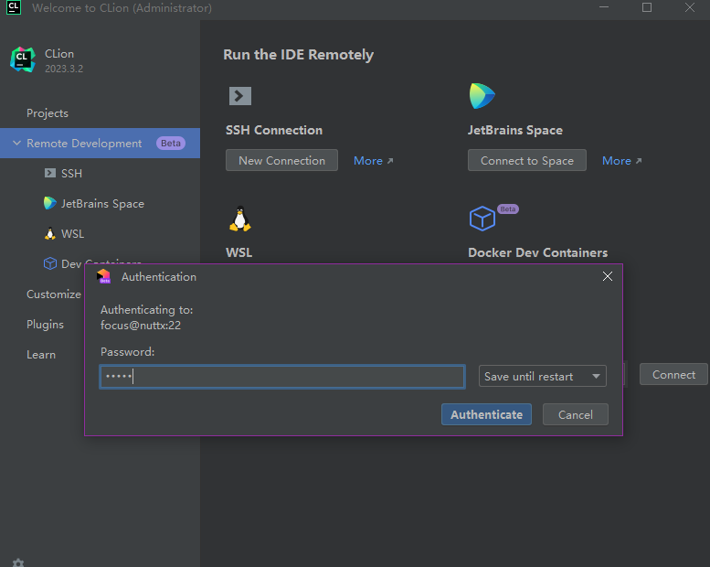
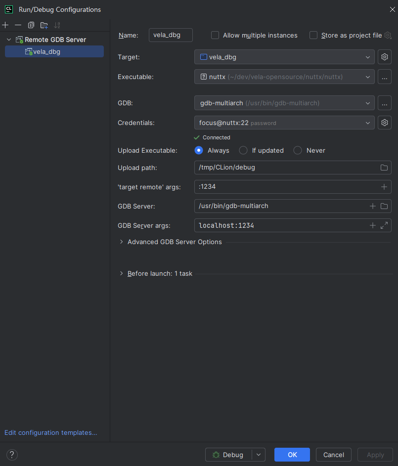
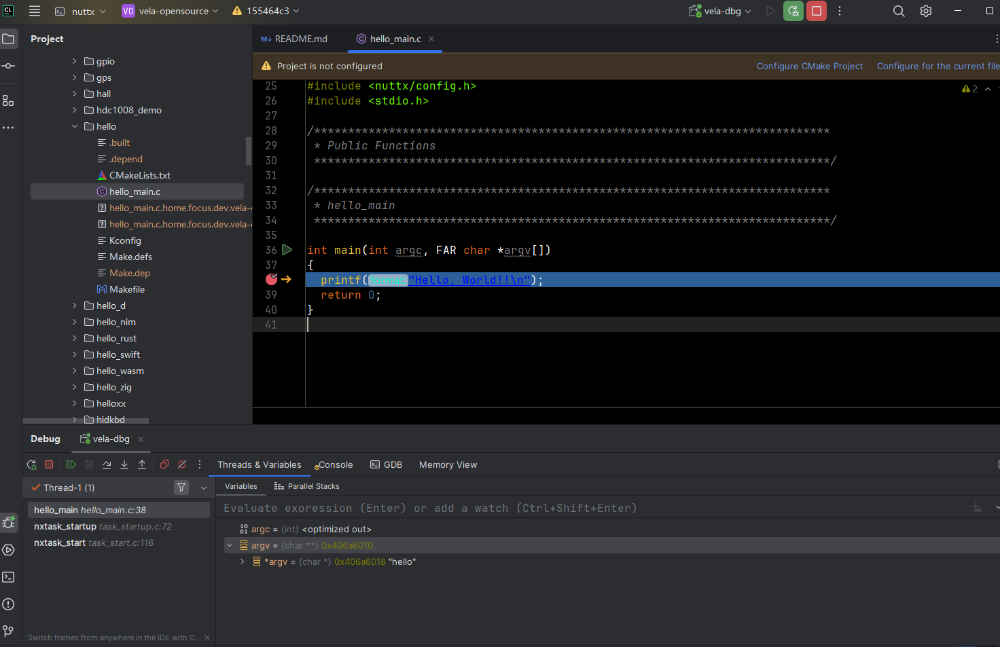

# Debugging with openvela Emulator

\[ English | [简体中文](./../../zh-cn/quickstart/Debugging_Vela_with_Vela_Emulator_zh-cn.md) \]

## Using GDB Console

Use the following commands to install the required package on a Ubuntu 22.04 system:

```bash
sudo apt update
sudo apt install gdb-multiarch
```

openvela Emulator supports working with GDB via its remote connection tool (gdbstub).You can debug openvela code as if the debugging is done on real hardware with low-level tools such as JTAG.You can stop and start the virtual machine, check the status of registers and memory, and set breakpoints and watchpoints.

In order to use GDB, launch openvela Emulator with the “-s” and ”-S” options. The “-s” option lets openvela Emulator listen for an incoming connection from GDB on TCP port 1234, whereas the “-S” lets openvela Emulator not start the guest virtual machine until there is notification from GDB.

To enable the connection to the GDB server, you need to send the “-qemu -S –s” parameter to “emulator.sh”.

```bash
./emulator.sh vela -qemu -S -s
```

Open a new terminal and run “gdb-multiarch”:

```bash
gdb-multiarch nuttx/nuttx
```

```bash
GNU gdb (Ubuntu 12.1-0ubuntu1~22.04.2) 12.1
Copyright (C) 2022 Free Software Foundation, Inc.
License GPLv3+: GNU GPL version 3 or later <http://gnu.org/licenses/gpl.html>
This is free software: you are free to change and redistribute it.
There is NO WARRANTY, to the extent permitted by law.
Type "show copying" and "show warranty" for details.
This GDB was configured as "x86_64-linux-gnu".
Type "show configuration" for configuration details.
For bug reporting instructions, please see:
<https://www.gnu.org/software/gdb/bugs/>.
Find the GDB manual and other documentation resources online at:
    <http://www.gnu.org/software/gdb/documentation/>.

For help, type "help".
Type "apropos word" to search for commands related to "word"...
Reading symbols from nuttx/nuttx...
```

You need to create a remote connection, so that the host’s GDB will be connected to the GDB Server of openvela Emulator.

Once connected, debugging can be done in a simulated environment, just like how other applications are debugged.

```bash
(gdb) target remote localhost:1234
```

```bash
Remote debugging using localhost:1234
__start () at armv7-a/arm_head.S:207
207		cpsid		if, #PSR_MODE_SYS
```

Set a breakpoint:

```bash
(gdb) b nx_start
```

```bash
Breakpoint 1 at 0x601cdc: file init/nx_start.c, line 317.
```

Continue to execute:

```bash
(gdb) c
```

```bash
Continuing.

Breakpoint 1, nx_start () at init/nx_start.c:317
317	{
```

Display the source code:

```bash
(gdb) l
```

```
312	 *   Does not return.
313	 *
314	 ****************************************************************************/
315	
316	void nx_start(void)
317	{
318	  int i;
319	
320	  sinfo("Entry\n");
321
```

Display all the breakpoint information in the current GDB session:

```bash
(gdb) info break
```

```bash
Num     Type           Disp Enb Address    What
1       breakpoint     keep y   0x00601cdc in nx_start at init/nx_start.c:317
	breakpoint already hit 1 time
```

Enable or disable breakpoints:

```bash
disable <breakpoint-number>
enable <breakpoint-number>
```

Delete breakpoints:

```bash
d <breakpoint-number>
```

Exit GDB:

```bash
(gdb) q
```

## Using Visual Studio Code

1. Visit https://code.visualstudio.com/ to install Visual Studio Code.

2. Install the Visual Studio Code extension.

    ```bash
    code --install-extension ms-vscode.cpptools-extension-pack
    ```

3. Open the openvela workspace.

   To open the workspace, go to the “File” > “Open Folder”... menu, and select the folder where openvela is located.

   Alternatively, if you launch Visual Studio Code using a terminal, you can use the source code path of openvela as the first parameter for a “code” command.

   For example, use the following command to open the current directory as a workspace for Visual Studio Code.

    ```bash
    code .
    ```

4. Add the startup configuration.

   To debug or run the openvela source code in Visual Studio Code, select “Run and Debug” on the Debug view or press F5. Then, Visual Studio Code will run the current active file.

   For most debugging scenarios, it is useful to create a startup configuration file that can be used to configure and save the debug settings. Save the debug configurations in a “launch.json” file located in a “.vscode” folder in the workspace (project’s root folder) or in the user settings or workspace settings.

   To create a “launch.json” file, select “create a launch.json file” in the Run start view.

   The following is the startup configurations for debugging openvela:

    ```bash
    {
        // Use IntelliSense to learn about possible attributes.
        // Hover to view descriptions of existing attributes.
        // For more information, visit: https://go.microsoft.com/fwlink/?linkid=830387
        "version": "0.2.0",
        "configurations": [
            {
                "name": "Debug openvela",
                "type": "cppdbg",
                "request": "launch",
                "program": "${workspaceFolder}/nuttx/nuttx",
                "cwd": "${workspaceFolder}",
                "MIMode": "gdb",
                "miDebuggerPath": "/usr/bin/gdb-multiarch",
                "miDebuggerServerAddress": "localhost:1234"
            }
        ]
    }
    ```

   If you go back to the File Explorer view (Ctrl+Shift+E), you will see that Visual Studio Code has created a “.vscode” folder and added the “launch.json” file to the workspace.

5. Launch openvela Emulator with the “-s” and “-S” options to use GDB.

    ```bash
    ./emulator.sh vela -qemu -S -s
    ```

6. Start a debug session.

   To start a debug session, use the “Configuration” drop-down list in the Run and Debug view and select the “Debug openvela” configuration.After setting the startup configuration, use `F5` to start a debug session.

## Use Clion(Remote Debug)

1. download clion from here (recommend newer version) https://www.jetbrains.com/clion/

2. Config SSH Configurations

   click `Customize | All Settings` to menu from Welcome page
   (if you already open a project click `File | Close Project` back to welcome page)

   click the `+` button and fill the ssh info (then check) like this
   

3. Config and Choose Remote Project

   On Welcome page select `Remote Development | SSH | New Project`
   select the ssh connection we config before and click the button `Check Connection and Continute`
   choose ide then select the project when we clone before
   then click `Start IDE and Connect`

   

   wait for download finish and `Authenticate` like this
   

4. Create Debug Configuration

   click `Add Configuration | Remote GDB Server` and config like this
   

   Target can be created with default(just a target)
   

5. Launch openvela Emulator with the `-s` and `-S` options to use gdb.

    ```
    ./emulator.sh vela -qemu -S -s
    ```

6. Start a debug session.

   click debug icon then we can debug
   

   (you would get the confirmation when you do the first debug)
   
   
