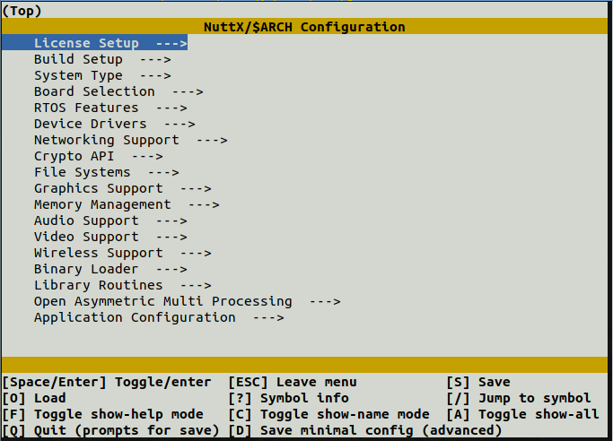

# 手环Bandx Demo

\[ [English](../../en/demo/Smart_Band_Example.md) | 简体中文 \]

## 简介
Bandx 是一款智能手环演示，包括手表表盘、启动器、音乐、心率、秒表、睡眠、运动、设置、手电筒，分辨率为 194*368。可以在 `apps/packages/demos/bandx/` 目录中了解有关 bandx 的更多详细信息。

本文介绍如何在 openvela Emulator 上运行该示例。

## 前提条件

1. 搭建开发环境，请参见[环境搭建](../quickstart/Set_up_the_development_environment_zh-cn.md)。

2. 下载源码，请参见[下载 openvela 源码](../quickstart/Download_Vela_sources_zh-cn.md)。


## 步骤一 配置项目

1. 切换到 openvela 仓库的根目录，执行如下命令来配置手环 Bandx。
    >    模拟器配置文件（defconfig）在 `vendor/openvela/boards/vela/configs/goldfish-armeabi-v7a-ap/` 目录下，使用 `build.sh` 配置和编译模拟器的代码。

    ```cpp
    ./build.sh vendor/openvela/boards/vela/configs/goldfish-armeabi-v7a-ap menuconfig
    ```

    - build.sh：编译脚本，用来配置和编译 openvela 代码
    - vendor/openvela/boards/vela/configs/goldfish-armeabi-v7a-ap：配置路径
    - menuconfig：打开 menuconfig 页面，修改项目代码的配置。

    执行后出现如下界面：

    

2. 按下 `/` 键逐个搜索修改如下配置项：

    ```Bash
    LV_USE_FRAGMENT = y
    LVX_USE_DEMO_BANDX = y
    BANDX_BASE_PATH = "/data"
    ```
    > 以LV_USE_FRAGMENT为例进行操作，其余配置方式相同。

    1. 输入待搜索的配置。

        

    2. 按下`Enter`进入到配置页面。

        

    3. 按下`Enter`键打开该配置，`[ ]` 中出现 `*` 表示该配置被打开。

        

    4. 按下 `/` 键可以继续搜索剩下的配置，并按上述步骤修改其余配置。

    5. 按下字母`Q`键，弹出如下退出保存界面。

        

    6. 按下字母`Y`键保存配置，并退出修改配置页面。

## 步骤二 编译项目

1. 切换到 openvela 仓库的根目录，在终端内依次执行如下命令：

    ```Bash
    # 清理构建产物
    ./build.sh vendor/openvela/boards/vela/configs/goldfish-armeabi-v7a-ap distclean -j$(nproc)

    # 开始构建
    ./build.sh vendor/openvela/boards/vela/configs/goldfish-armeabi-v7a-ap -j$(nproc)
    ```

2. 成功执行后，将得到以下文件：

    ```cpp
    ./nuttx
    ├── vela_ap.elf
    ├── vela_ap.bin
    ```

## 步骤三 启动模拟器并推送资源

Bandx 中使用的字体和图像资源位于 `apps/packages/demos/bandx/resources/` 中，要将这些资源推送到模拟器挂载的相应文件路径，可以按照以下步骤操作。

1. 切换到 openvela 仓库的根目录，启动模拟器：

    ```bash
    ./emulator.sh vela
    ```

2. 使用模拟器支持的 `ADB` 将资源推送到设备，在 openvela 仓库的根目录下打开一个新的终端，输入 `adb push` 后跟文件路径，即可将资源传输到相应位置。

    ```bash
    # 安装adb
    sudo apt install android-tools-adb

    # 推送资源
    adb push apps/packages/demos/bandx/resource/font/assets/* /data/font/
    adb push apps/packages/demos/bandx/resource/image/assets /data/image/
    ```

    > 如果将 `BANDX_BASE_PATH` 更改为非默认值，如 `/tmp`，则资源文件也必须传输到 `/tmp/font/` 和 `/tmp/image/` 目录。否则将出现找不到资源的错误。

## 步骤四 启动 Bandx

1. 在模拟器的终端环境 `openvela-ap>` 中输入如下命令：

    ```Bash
    bandx &
    ```

    

2. 要访问 Launcher 界面，`从右向左`快速滑动。单击不同的图标导航到子页面，如下图所示的 Heart Rate 页面。要退出页面，`从左向右`快速滑动。

    > 说明：music页面只是UI展示，没有接入音频。

    

3. 打开 settings 中的 `Auto-show`，将会自动播放整个应用；关闭 `Auto-show`，自动播放就结束。

## 步骤五 退出 Demo

关闭模拟器退出 Demo，如下图所示：


## 常见问题
### 1. adb 命令找不到

#### 原因
未安装 `adb` 工具。

#### 解决方案
安装 `adb`，执行以下命令：

``` Bash
sudo apt install android-tools-adb
```

### 2. 字体显示为乱码

#### 原因
未正确加载字体资源。

#### 解决方案
请按[步骤三](#步骤三-启动模拟器并推送资源)进行资源推送。